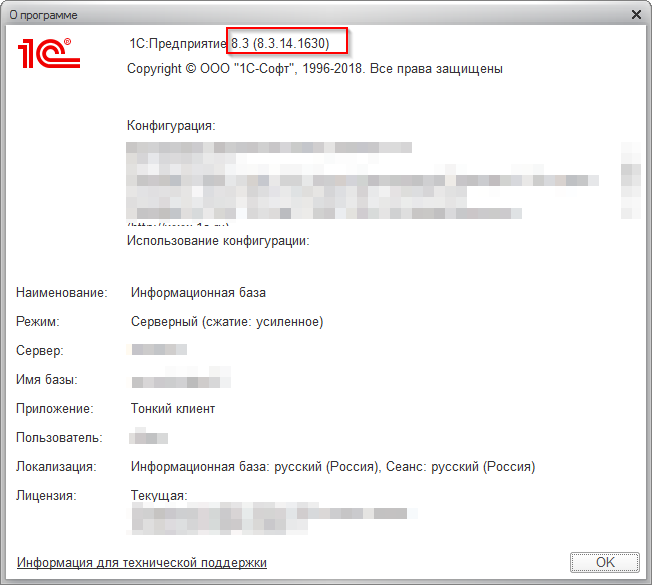
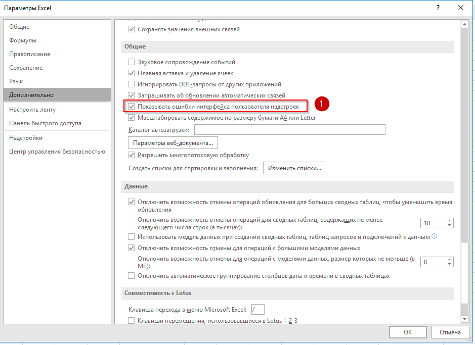

+++
date = "2019-06-18T00:00:00"
highlight = true
math = false
tags = ["Вопросы и Ответы", "1С", "Markdown", "Excel", "надстройки Excel" ]
draft = false
title = "Короткие вопросы и ответы"

[header]
  caption = ""
  image = ""
+++

#### Где посмотреть возможности маркдаун?

[Учебник по markdown](https://commonmark.org/help/tutorial/index.html) от разработчиков протокола [Commonmark](https://commonmark.org).

#### Как регулировать размер изображения в маркдаун?

[Маркдаун]((https://commonmark.org/help/tutorial/08-images.html)) этого не позволяет сделать.
[Используйте](https://github.com/hakimel/reveal.js/issues/1349) html тэг `img`, например так

```

```

<a name="how-to-schow-1C8-version"></a>

#### Как посмотреть версию 1С 8?

* Зайти в текущий клиент 1С. 
* В верхнем левом углу выбрать кнопку "меню" \ Справка \ О программе.


* Откроется окно "О программе", смотрите версию:


* Заходим в каталог: `C:\Program Files\1cv8\` и выбираем каталог с именем найденной версии.


#### Как зарегистрировать библиотеку 1С 8 `comcntr.dll`

* [Определить](#how-to-schow-1C8-version) действующую версию 1С
* Запустить терминал `cmd` под учетной записью администратора
* Замените в тексте кода ниже `<ВЕРСИЯ_1С>` на найденную версию:

```cmd
C:\Windows\SysWOW64\regsvr32 "C:\Program Files\1cv8\<ВЕРСИЯ_1С>\bin\comcntr.dll"
```

* Выполните
* Если все прошло хорошо, получите сообщение вида:


#### Я разрабатываю вкладку для Excel, она не загружается как понять почему?

* В Excel по умолчанию ошибки пользовательского интерфейса скрываются.
* Для того что бы отобразить, нужно зайти в **параметры Excel** \ Пункт меню **Дополнительно** \ Раздел **Общие** \ Поставить флажок **Показывать ошибки интерфейса пользователя надстроек**


#### Я разрабатываю пользовательскую вкладку в Excel, как найти имена картинок для заполнения тега `imageMSO`?

[Список иконок `imageMSO`](https://bert-toolkit.com/imagemso-list.html)